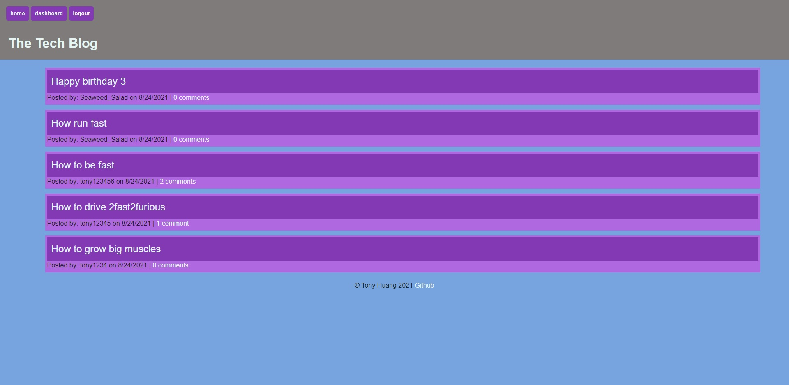
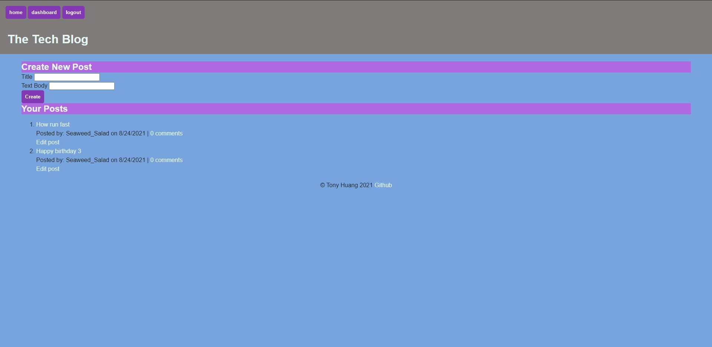
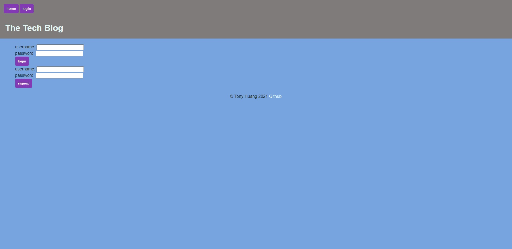
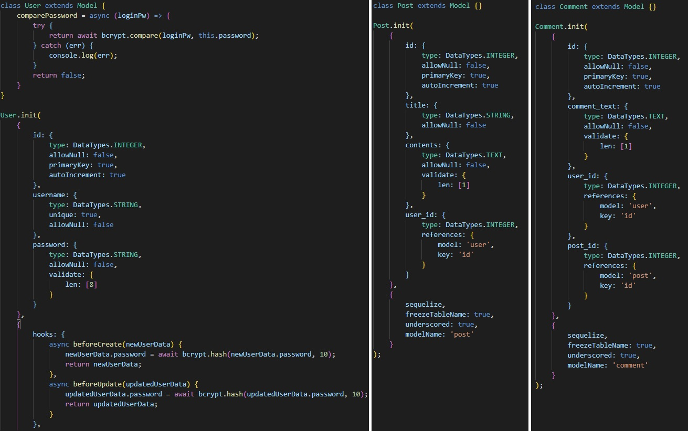

# Tech Blog
The goal of this project is to create a website that allows (registered) developers to publish blog posts and comment on other posts as well. The page will be deployed on <a href="https://blog-news-mvc.herokuapp.com/" target="_blank">Heroku</a>. Made following the Model-View-Controller (MVC) paradigm in the architectural structure with Handlebars.js as the templating language and Sequelize as the ORM.

## Table of Contents
* [Criteria](#criteria)
* [Tools Used](#tools-used)
* [Contributions](#contributions)
* [Live Deployment](#live-deployment)
* [Final Results](#final-result)

## Criteria
* Presented homepage upon first visit to site includes
    * existing blog posts
    * navigation links
        * homepage
        * dashboard
    * log in option
* homepage leads to homepage
* other navigation links prompt for either a sign in or sign up
    * for sign up
        * prompts for new username and password
    * for sign in
        * prompts for username and password
* when signed in
    * navigation links
        * homepage
        * dashboard
        * log out
* blog posts are presented with title and date created
* clicking on a blog post presents
    * post title
    * contents
    * post creator's username
    * date created
    * option to leave comment
* when leaving a comment, click on submit button while signed in
    * comment saved and post updates to display comment. commentor's username, and date created
* dashboard presents user with blogs they created with option to write a new one
* for a new blog post
    * prompts for title and content
    * when clicking on button to add blog post
        * post is saved and user redirected to dashboard with new post visible
* clicking on existing post in dashboard
    * user given option to delete or update post and is taken back to updated dashboard
* clicking logout ends session and returns user to homepage
* sessions expire and prompts user to log in again if idle for extended period

### Tools used
Express.js
Node.js
Sequelize
BCrypt
Handlebars.js

## Contributions
Designed and written by Tony Huang

## Live Deployment
The website will be available on <a href="https://blog-news-mvc.herokuapp.com/" target="_blank">Heroku</a>.

## Final Results
Main homepage of website

Dashboard view

Log in and sign up

Sample structure of Sequelize

